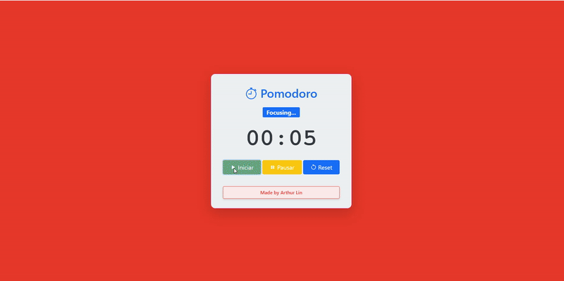
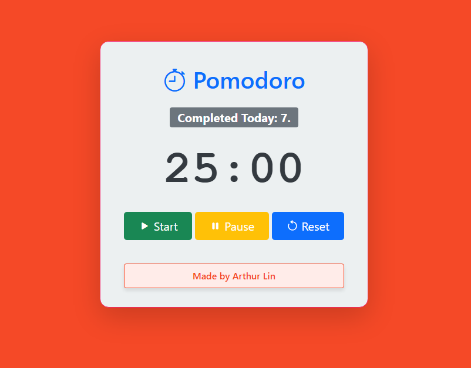
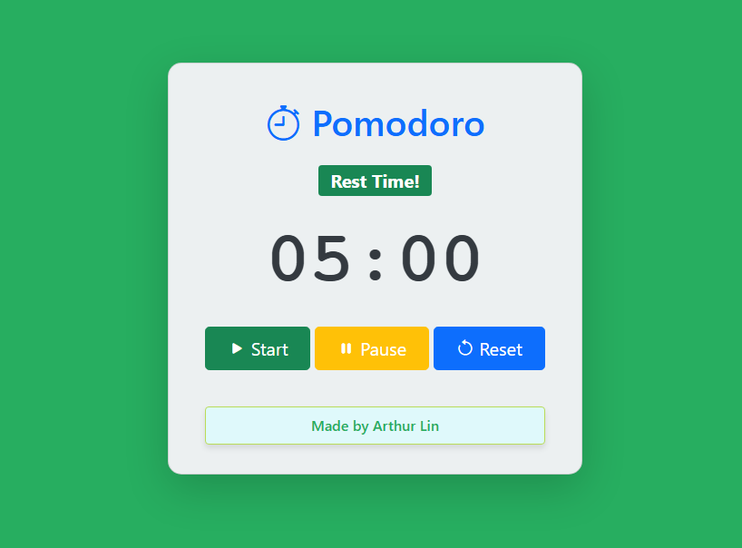

# 🍅 Pomodoro Timer App
The Pomodoro technique really helped me stay focused on tasks I used to struggle with, both in my studies and at work. Because of that, I felt inspired to build my own Pomodoro app.

This full-stack web application helps users manage their time effectively using the Pomodoro Technique. It features a customizable timer, audio alerts, and stores all focus sessions in a SQL Server database.

For a while, I’ve been using the technique through the website (https://pomofocus.io/)
, created by Yuya Uzu, and since then my productivity has improved a lot. This project also helped me improve my skills in MVC architecture, backend–frontend communication, and SQL Server data handling. I hope it can help you too!

## Features

- **Timer Control:** Start, pause, and reset functionality.
- **Visual Feedback:** Dynamic theme changes based on status (Focus 🔴 vs. Rest 🟢).
- **Audio Alerts:** Sound notification when the timer completes.
- **Data Persistence:** Automatically saves finished sessions to **SQL Server**.
- **History Tracking:** Dashboard displays the total count of focused sessions for the day.
- **Configurable:** Built to easily adjust timer duration in the backend.

## Tech Stack

**Backend**
- C# (.NET 8)
- ASP.NET Core MVC
- Entity Framework Core (Code-First)
- SQL Server

**Frontend**
- JavaScript (Vanilla)
- HTML5 & CSS3
- Bootstrap 5

## Screenshots

### Focus Mode 🔴

### Rest Mode 🟢

## How to Run

### Prerequisites
- [.NET 8 SDK](https://dotnet.microsoft.com/download)
- [SQL Server Express](https://www.microsoft.com/en-us/sql-server/sql-server-downloads) (or LocalDB)

### Installation

1. **Clone the repository**
   bash
   git clone [https://github.com/arthurmlin03/PomodoroAPP.git](https://github.com/arthurmlin03/PomodoroAPP.git)
   cd PomodoroAPP

2. **Configure Database** Update the connection string in appsettings.json if necessary. By default, it uses LocalDB:

"ConnectionStrings": {
  "DefaultConnection": "Server=(localdb)\\mssqllocaldb;Database=PomodoroDB;Trusted_Connection=True;MultipleActiveResultSets=true"
}

3. **Apply Migrations** Create the database and tables using Entity Framework Core
   bash
   dotnet ef database update

4. **Run the app**
   bash
   dotnet run

   Access the application at http://localhost:5000 (or the port shown in your terminal).

**Database Schema**
The application uses a simple schema to track history:

Table: PomodoroRecords

Id (PK, int)

FinishedAt (DateTime)

DurationMinutes (int)

